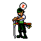

# 👾 Sobre:

 

  👨🏻‍💻 Engenheiro de Software ☕ Explorando Cybersecurity 
 

 
 

## 🌐 Onde me encontrar:
  

# 💻 Tech Stack:
                  

# 📊 GitHub Stats:
 
<!--   

  
---
 -->

<!-- Proudly created with GPRM ( https://gprm.itsvg.in ) -->
